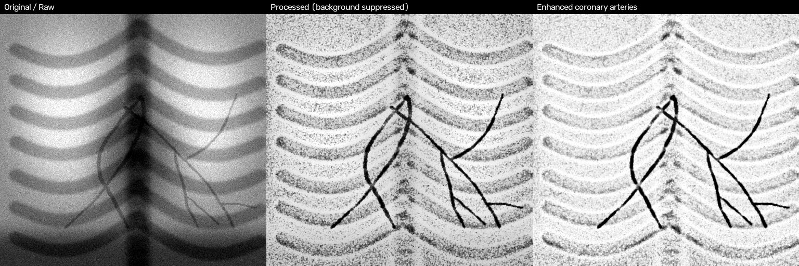

# Real-Time Coronary Artery Enhancement (16-bit X-ray / Cine)

Suppresses ribs, spine, lungs and noise in cardiac X-ray angiography frames while preserving and
enhancing the contrast-filled coronary arteries. Pure CPU, classical image processing, 16-bit end to end.
**~12 ms/frame at 512x512 and ~15 ms/frame at 1024x1024 on a single 2.1 GHz vCPU (limit: 36 ms).**


*Raw | Processed (background suppressed) | Enhanced coronary arteries (synthetic test frame).*

## 1. Setup & Installation
```bash
git clone <your-repo-url> && cd coronary-enhance
python -m venv .venv && source .venv/bin/activate      # Windows: .venv\Scripts\activate
pip install -r requirements.txt
python -m pytest -q tests                              # optional: pip install pytest
```
Python 3.10+ (tested on 3.12). No GPU needed.

## 2. Usage
```bash
python scripts/run_demo.py --synthetic                         # demo -> results/comparison.png
python scripts/run_demo.py --input frame.png                   # 16-bit PNG/TIFF/NPY/DICOM frame
python scripts/run_demo.py --input cine.dcm --video --show     # multi-frame DICOM, MP4 + live window
python scripts/benchmark.py                                    # latency benchmark (writes results/benchmark.*)
python scripts/benchmark.py --input cine.dcm --frames 500      # benchmark on your own data
python scripts/evaluate.py                                     # AUC / Dice / CNR on synthetic ground truth
python scripts/generate_dataset.py --sequences 5 --frames 20   # regenerate / extend the dataset
```
Library use:
```python
from coronary_enhance import CoronaryPipeline, load_frame
pipe = CoronaryPipeline()
out = pipe.process(load_frame("frame.png"))    # uint16 HxW in
out["processed"], out["enhanced"], out["vesselness"]   # uint16 out (vessels dark)
pipe.reset()                                   # call at the start of each new cine run
```
Outputs are true 16-bit (`results/*_16bit.png`); `comparison.png` is 8-bit for viewing only.

## 2b. Web UI (image + video upload)
```bash
pip install -r requirements.txt          # adds flask + imageio-ffmpeg
python webapp/app.py                     # open http://127.0.0.1:5000
```
* **Image tab** - upload PNG/JPG/TIFF/NPY/DICOM, see *Original | Enhanced* side by side, download the 8-bit or true 16-bit PNG.
* **Video tab** - upload MP4/AVI/MOV/MKV/WEBM or a multi-frame DICOM cine; a progress bar is shown while it runs and the
  result is an **H.264 MP4** (video in -> video out) you can play in the page or download. Output can be
  *Enhanced only*, *Original | Enhanced* side by side, or *Processed*.
* Uploads/results live in `webapp/runs/` and are deleted after 1 hour. Env vars: `PORT`, `HOST`, `MAX_UPLOAD_MB` (default 1024).
* Video codecs are 8-bit, so the MP4 is an 8-bit rendering of the 16-bit result; use the image tab / `enhanced_16bit.png` for full 16-bit.

Python API:
```python
from coronary_enhance import process_image, process_video
process_image("frame.png", "out_dir")                     # -> out_dir/original.png, enhanced.png, enhanced_16bit.png
process_video("cine.mp4", "enhanced.mp4", mode="enhanced") # mode: enhanced | processed | compare
```

## 3. Dataset information
* `data/synthetic/` - 2 sequences x 10 frames, 512x512 uint16 PNG + ground-truth vessel masks, created by
  `coronary_enhance/synth.py` (physics-inspired: `I = I0*exp(-A)` + Poisson noise, with lungs, heart
  shadow, spine, 14 ribs and a moving, branching coronary tree). Legally free (self-generated).
* Real data is supported (DICOM/PNG/TIFF/NPY). Public angiography sets you can try (check each licence
  and terms yourself): ARCADE, DCA1, CADICA, XCAD. Most are 8-bit; hospital DICOM is usually 12-bit stored in 16-bit.

## 4. Model information
No trained model: the pipeline is deterministic classical image processing, so **no model file is required**
and latency is predictable. (A U-Net could be added as an optional refinement stage if labelled data is available.)

## 5. Processing pipeline (`coronary_enhance/pipeline.py`)
| # | Stage | Purpose |
|---|---|---|
| 1 | `L = -log(I)` + light Gaussian (0.8 px) | Log-attenuation domain: ribs, spine, lungs, vessels become **additive**; slight noise reduction |
| 2 | Morphological **opening** (elliptical SE ~ 1.6x max vessel width) at 1/2 resolution -> background `B` | Ribs, spine, lung fields, heart shadow are wider than vessels, so they survive the opening = background layer |
| 3 | `T = L - B` (+ noise-bias removal) | Removes bones/lungs/background; keeps thin bright structures (vessels) |
| 4 | Motion-adaptive recursive temporal filter | Cine noise reduction; pixels that move (vessels) are not smeared |
| 5 | Multi-scale Hessian ridge filter (sigma 1.3/2.2/3.2, blob-suppressed) | Vesselness map; rejects noise blobs and vertebra-like blobs |
| 6 | Robust normalisation (sub-sampled percentile + EMA) | Flicker-free brightness across frames |
| 7 | Adaptive local contrast + gamma, 16-bit output | Contrast/quality enhancement. `use_clahe=True` switches to OpenCV 16-bit CLAHE |

Outputs: **raw**, **processed** (`T`, background suppressed with a faint anatomical trace for orientation),
**enhanced** (`T` weighted by vesselness), **vesselness** map.
Frames larger than 512 px are analysed at 512 px and the results upsampled (keeps latency flat).

## 6. Performance / latency
Measured as *input frame handed to `process()` until final frames returned* (300 frames after 30 warm-up frames,
`time.perf_counter`, no disk I/O, no display):

| Input | Avg (ms) | Min (ms) | Max (ms) | P95 (ms) | FPS | <= 36 ms |
|---|---|---|---|---|---|---|
| 512x512 16-bit | 11.62 | 10.52 | 16.31 | 12.68 | 86 | YES |
| 1024x1024 16-bit | 14.51 | 12.23 | 18.49 | 17.11 | 69 | YES |

Hardware: Intel Xeon @ 2.10 GHz, **1 vCPU**, Linux, Python 3.12.3, OpenCV 4.13.0, NumPy 2.4.4, no GPU.
> **Before you submit:** re-run `python scripts/benchmark.py` on *your* machine and paste its
> `results/benchmark.md` here - the evaluation asks for your hardware configuration.

Per-stage cost (512x512, `PipelineConfig(profile=True)` -> `out["timings"]`): log+smooth 0.5 ms,
background 1.7 ms, temporal 0.7 ms, vesselness 5.8 ms, normalise 0.8 ms, compose+contrast 4.1 ms.

## 7. Quality results (synthetic ground truth, 4 sequences, `scripts/evaluate.py`)
| Image | ROC-AUC | Best Dice | CNR | Background clutter (lower = better) |
|---|---|---|---|---|
| Raw | 0.773 | 0.179 | 0.80 | 0.994 |
| Processed | 0.978 | 0.776 | 4.31 | 0.248 |
| Enhanced | 0.981 | 0.825 | 6.86 | 0.151 |

## 8. Limitations (be upfront in your report)
* Quantitative results are on **synthetic** frames. Real angiograms have catheters, diaphragm, sternal
  wires, sharp rib cortical edges and vessel overlap - tune `vessel_max_width` / `sigmas` to your pixel spacing
  and validate visually on real cine.
* Not a medical device; not clinically validated.
* Latency numbers depend on hardware; multi-core CPUs are faster (OpenCV threads).
